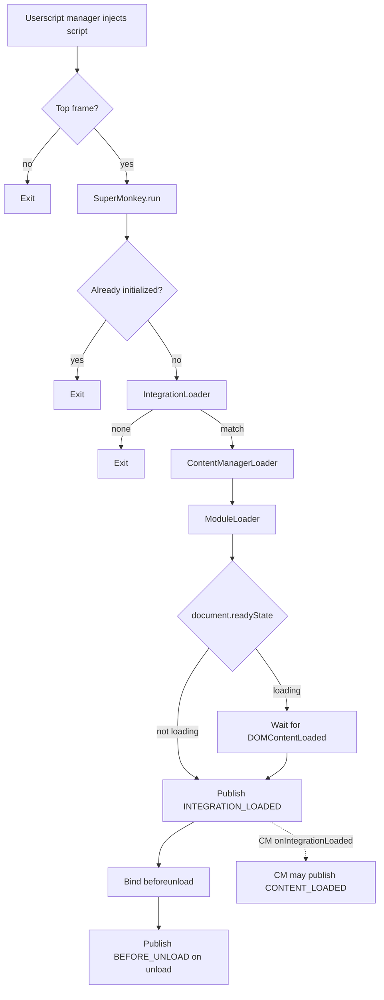

# Script Lifecycle

How Super Monkey boots after the userscript manager injects the script into a page.

### Minimum read for built-in authors

1. The script runs only in the **top frame** (`@noframes` + top-frame check).
2. Match uses the **effective registry** (built-ins + user storage). No match → no lifecycle events; the Integrations Menu still opens.
3. After a match, `SuperMonkey.loadedIntegration` exposes `name`, `getActivePages()`, optional Content Manager, and modules.
4. Verify in the Integrations Menu: provenance **`builtin`** (or `override`) and badge **`active`**.
5. Registry normalization drops invalid stored names; if a matched entry somehow still has an invalid `name`, activation fails and bootstrap stops without lifecycle events.

Read further below for EventBus hooks, handler interleaving, and the implementation map.

Entry flow: `src/main.ts` (top frame only) → `SuperMonkey.run()` → integration match → Content Manager and module loaders → lifecycle events on `EventBus`.

The script runs only in the top browsing context: `main.ts` exits when `window.self !== window.top`, and the userscript metadata sets `@noframes`.

`SuperMonkey.run()` runs **once per tab**. A second call logs an error and returns. After a full document navigation or a tab reload, the userscript runs again - see [Getting Started - Development reload](../development/getting-started.md#development-reload).

`SuperMonkey.run()` registers **Open Integrations Menu** before discovery. When **no** integration matches the current hostname, bootstrap stops after discovery. Lifecycle events are not published. The integrations list still opens from the Tampermonkey command. When a match has an **invalid** `name`, activation fails as an error and bootstrap stops the same way (no lifecycle events).

`IntegrationLoader` matches against the **effective registry**: built-ins plus user storage, each run through [opts normalization](../utils/opts-normalization.md). A stored entry with the same `name` replaces the built-in. See [TypeScript integration](../integrations/README.md).

## Overview

`@run-at` is `document-start` in `vite.config.ts`. Page CSS from modules uses `GM_addStyle` via `injectStyle`. Construction of loaders and `Component` instances may run while the document is still parsing; host mounting waits for `body` where needed.

## Component isolation

`SuperMonkey` is the only orchestrator that calls the loaders. Feature pieces do not import or invoke each other.

| Role                 | Type                                      | How it participates                                                                                               |
| -------------------- | ----------------------------------------- | ----------------------------------------------------------------------------------------------------------------- |
| Orchestrator         | `SuperMonkey`                             | Resolves the integration, loads scanners and modules, publishes `INTEGRATION_LOADED`; exposes `loadedIntegration` |
| Site match           | `IntegrationLoader`                       | Returns the first effective-registry integration for the tab hostname                                             |
| Content mapping      | `ContentManagerLoader` / `ContentManager` | Constructs at most one Content Manager; owns `CONTENT_LOADED`                                                     |
| Feature modules      | `ModuleLoader` / `Module`                 | Constructs named module instances from `integration.modules`                                                      |
| Lifecycle-aware unit | `Component`                               | Subscribes to lifecycle events at construction                                                                    |
| Coordination         | `EventBus`                                | Process-wide pub/sub for lifecycle and content-pipeline events                                                    |

`SuperMonkey.loadedIntegration` is `undefined` until a hostname matches. After a match it holds `{ name, getActivePages, contentManager?, modules? }`. `getActivePages()` returns mapped-page names that match the current pathname (live). When no integration matches, the integrations menu still opens and sees `undefined` for the active name.

`ContentManager` and `Module` extend `Component`. Construction registers `EventBus` handlers that forward to hooks. Content Manager publishes `CONTENT_LOADED` from `onIntegrationLoaded` and scans on each `CONTENT_LOADED` - see [Content Manager](../modules/content-manager.md). Modules that do not depend on Content Manager override `onIntegrationLoaded` only. Content-dependent modules override `onContentLoaded`. `Module` also subscribes to Content Manager pipeline event names (`entity-viewed`, `entities-parsed`, `entities-injected`). `hasListingContext` is reached through `SuperMonkey.loadedIntegration?.contentManager` when needed.

Event type strings are trimmed and lowercased before subscribe and publish match. Handlers run in parallel. A handler failure is logged and does not reject `publish` or stop other handlers. Full contract: [Event bus](../utils/event-bus.md).

### Handler interleaving

`ContentManager` publishes `CONTENT_LOADED` from its `onIntegrationLoaded` handler while other `INTEGRATION_LOADED` subscribers may still be running (`EventBus.publish` uses `Promise.all`). Scans and `onContentLoaded` hooks can therefore overlap with remaining `onIntegrationLoaded` work. Prefer:

- Chrome and preferences that do not need Content Manager → `onIntegrationLoaded`
- Listing/DOM work that needs a scanned document → `onContentLoaded`

Do not assume every `INTEGRATION_LOADED` handler finished before the first `CONTENT_LOADED`.

## `INTEGRATION_LOADED`

After loaders run, `SuperMonkey` waits until the tab document is ready, then publishes `LifecycleAwareEvent.INTEGRATION_LOADED` (`integration-loaded`) **once**:

- If `document.readyState !== "loading"`, it publishes immediately.
- Otherwise it waits for `DOMContentLoaded`, then publishes.

Payload (`IntegrationLoadedEventPayload`):

| Field      | Meaning                                     |
| ---------- | ------------------------------------------- |
| `document` | The live tab document, ready for DOM chrome |

Use `Component.onIntegrationLoaded` for Notification Bar chrome, Configuration Menu command registration, and other work that does not depend on Content Manager.

## `CONTENT_LOADED`

**Owner:** Content Manager. The event exists only when Content Manager is loaded for the integration.

On `INTEGRATION_LOADED`, Content Manager publishes `LifecycleAwareEvent.CONTENT_LOADED` (`content-loaded`) with the live tab document. Modules or Content Manager may **republish** `CONTENT_LOADED` with another `Document` (for example a fetched listing page).

Payload (`ContentLoadedEventPayload`):

| Field      | Meaning                                                     |
| ---------- | ----------------------------------------------------------- |
| `document` | Content document ready to scan (live tab or a fetched page) |

On each emission, Content Manager runs a full scan (views then listings) on that document and starts interval rescans once when configured. Content-dependent modules (for example [Additional Pages](../modules/additional-pages.md)) override `onContentLoaded` and ignore foreign documents when they only act on the live tab.

`Component.onContentLoaded` handlers tolerate repeated `CONTENT_LOADED` emissions.

Without Content Manager, `CONTENT_LOADED` is never published.

## `BEFORE_UNLOAD`

After `INTEGRATION_LOADED`, `SuperMonkey` binds `window` `beforeunload`. That native event publishes `LifecycleAwareEvent.BEFORE_UNLOAD` (`before-unload`).

Payload (`BeforeUnloadEventPayload`):

| Field                     | Meaning                                                                                                                    |
| ------------------------- | -------------------------------------------------------------------------------------------------------------------------- |
| `notifyPendingOperations` | Signals pending work to the browser unload dialog. Call **synchronously** from the handler; deferred calls may be ignored. |

The callback calls `event.preventDefault()` on the native `beforeunload` event. Override `Component.onBeforeUnload` to flush or cancel work, and call `notifyPendingOperations()` when the tab should prompt before leaving.

## Implementation map

| Concern               | Location                                                             |
| --------------------- | -------------------------------------------------------------------- |
| Entry                 | `src/main.ts`                                                        |
| Bootstrap             | `src/supermonkey/supermonkey.ts`                                     |
| Lifecycle hooks       | `src/supermonkey/lifecycle/component.ts`                             |
| Lifecycle event names | `src/supermonkey/lifecycle/events.ts`                                |
| Pub/sub               | `src/supermonkey/event-bus/event-bus.ts`                             |
| Integration match     | `src/supermonkey/integrations/integration-loader.ts`                 |
| Effective registry    | `src/supermonkey/integrations/integrations-registry.ts`              |
| Integration normalize | `src/supermonkey/integrations/store/normalize-stored-integration.ts` |
| User storage          | `src/supermonkey/integrations/store/user-integrations-store.ts`      |
| Built-in registry     | `src/supermonkey/integrations/builtin/builtin.ts`                    |
| Content Manager load  | `src/supermonkey/content-manager/content-manager-loader.ts`          |
| Module load           | `src/supermonkey/modules/module-loader.ts`                           |
| Console logger        | `src/supermonkey/utils/logger.ts`                                    |
| Userscript header     | `vite.config.ts` (`monkey()` opts)                                   |

## See also

- [Overview](./overview.md)
- [Event bus](../utils/event-bus.md)
- [TypeScript integration](../integrations/README.md)
- [Opts normalization](../utils/opts-normalization.md)
- [Content Manager](../modules/content-manager.md)
- [Authoring a module](../modules/authoring.md)
- [Getting Started](../development/getting-started.md)
- [Debugging](../development/debugging.md) - console signals for each stage
- `AGENTS.md` at the repository root - agent-oriented project reference
